# Project Documentation

Welcome to the **ibmegranite** project! This documentation dives into the core files of the repository, explaining their purpose, structure, and relationships.  

## 📑 Index

- [src/context/LoadingContext.jsx](#srccontextloadingcontextjsx)  
- [src/pages/Home.jsx](#srcpageshomejsx)  
- [src/App.jsx](#srcappjsx)  
- [src/main.jsx](#srcmainjsx)  
- [index.html](#indexhtml)  
- [package.json](#packagejson)  
- [vite.config.js](#viteconfigjs)  
- [eslint.config.js](#eslintconfigjs)  

---

## 🗂️ src/context/LoadingContext.jsx

**Purpose:**  
Provides a **React Context** and custom hook to manage a global loading state across the app.

```jsx
"use client";
import React, { createContext, useState, useContext } from "react";

// 1. Create Context
const LoadingContext = createContext();

// 2. Create Provider
export const LoadingProvider = ({ children }) => {
  const [loading, setLoading] = useState(false);
  return (
    <LoadingContext.Provider value={{ loading, setLoading }}>
      {children}
    </LoadingContext.Provider>
  );
};

// 3. Custom Hook for easy use
export const useLoading = () => useContext(LoadingContext);
```

### 🔍 Breakdown

| Part                      | Description                                                                                |
|---------------------------|--------------------------------------------------------------------------------------------|
| `createContext()`         | Initializes a context to hold `{ loading, setLoading }`.                                   |
| `LoadingProvider`         | Wraps child components, exposing loading state and setter via context.                     |
| `useLoading()` hook       | Simplifies consumption of context in any component (calls `useContext`).                   |

### 🤝 Relationships

- **Used by**: `src/App.jsx` to wrap the entire component tree.  
- **Consumed in**: `src/pages/Home.jsx` to toggle/loading UI during API calls.

---

## 🏠 src/pages/Home.jsx

**Purpose:**  
Renders the main UI: an input for user prompts, a “Push” button to submit, and a conversation view. Handles API interaction via **Axios** and uses the loading context.

```jsx
import axios from "axios";
import React, { useState } from "react";
import { useLoading } from "../context/LoadingContext";

export default function Home() {
  const [prompt, setPrompt] = useState("");
  const { loading, setLoading } = useLoading();
  const [data, setData] = useState([]);
  const [myPrompt, setMyPrompt] = useState([]);

  // Send prompt to backend, update state & scroll
  const postResponse = async () => {
    setLoading(true);
    const response = await axios.post(process.env.VITE_URL_BE, { prompt });
    setData(prev => [...prev, response.data.data]);
    setMyPrompt(prev => [...prev, prompt]);
    setPrompt("");
    setLoading(false);
    window.scrollTo(0, document.body.scrollHeight);
  };

  return (
    <div className="block min-h-screen w-full bg-neutral-900 px-10 sm:px-20 md:px-40 lg:px-60 xl:px-96">
      {/* Input bar */}
      <div className="flex flex-row gap-2 w-full sticky top-0 py-4 bg-neutral-900">
        <input
          type="text"
          value={prompt}
          onChange={e => setPrompt(e.target.value)}
          placeholder="Ask me anything"
          className="p-2 w-full bg-white rounded-2xl"
        />
        <button
          onClick={postResponse}
          className="rounded-2xl bg-black text-white p-3 hover:bg-neutral-950"
        >
          Push
        </button>
      </div>

      {/* Loading indicator or chat history */}
      {loading ? (
        <div className="text-white">Loading...</div>
      ) : (
        <div className="flex flex-col gap-4">
          {data.map((item, i) => (
            <div className="flex flex-col gap-4 w-full" key={i}>
              <div className="p-4 bg-neutral-500 text-white w-fit rounded-2xl ml-auto">
                {myPrompt[i]}
              </div>
              <div className="p-4 bg-neutral-700 text-white w-fit rounded-2xl">
                {item}
              </div>
            </div>
          ))}
        </div>
      )}
    </div>
  );
}
```

### 🔍 Breakdown

- **State Variables**  
  - `prompt` (string): current user input  
  - `data` (array): backend responses  
  - `myPrompt` (array): history of submitted prompts  

- **Context**  
  - Reads `loading` and `setLoading` from `useLoading()`  

- **API Call**  
  - Uses `axios.post` to `process.env.VITE_URL_BE`  
  - Updates both `data` and `myPrompt` arrays  
  - Manages scroll to bottom  

### 📈 Data Flow Diagram

```mermaid
sequenceDiagram
  participant U as User
  participant H as Home.jsx
  participant C as LoadingContext
  participant A as Axios
  participant B as Backend

  U->>H: Enter prompt & click Push
  H->>C: setLoading(true)
  H->>A: POST prompt → VITE_URL_BE
  A->>B: HTTP Request
  B-->>A: 200 OK + data
  A-->>H: response.data
  H->>H: update state (data, myPrompt)
  H->>C: setLoading(false)
  H->>U: render history & response
```



---

## 📦 src/App.jsx

**Purpose:**  
Root React component that establishes global context and renders the main page.

```jsx
import { LoadingProvider } from "./context/LoadingContext";
import Home from "./pages/Home";

function App() {
  return (
    <LoadingProvider>
      <Home />
    </LoadingProvider>
  );
}

export default App;
```

### 🔍 Breakdown

- **Imports**  
  - `LoadingProvider`: wraps children to provide loading context  
  - `Home`: primary page component  

- **Render Tree**  
  ```
  <LoadingProvider>
    <Home />
  </LoadingProvider>
  ```

### 🤝 Relationships

- **Mounted by**: `src/main.jsx`  
- **Wraps**: `Home`, enabling access to loading state  

---

## 🚀 src/main.jsx

**Purpose:**  
Application entry point. Mounts React tree into the DOM and enables strict-mode checks.

```jsx
import { StrictMode } from "react";
import { createRoot } from "react-dom/client";
import "./index.css";
import App from "./App.jsx";

createRoot(document.getElementById("root")).render(
  <StrictMode>
    <App />
  </StrictMode>
);
```

### 🔍 Breakdown

| Step                       | Description                                           |
|----------------------------|-------------------------------------------------------|
| `import "./index.css"`     | Loads global styles (Tailwind CSS utility classes)    |
| `createRoot(...)`          | Selects `<div id="root">` in **index.html**           |
| `.render(<App />)`         | Renders the entire React component tree               |
| `<StrictMode>`             | Activates additional checks and warnings in dev mode  |

---

## 🌐 index.html

**Purpose:**  
Static HTML template served by Vite. Provides the mount point for the React app.

```html
<!doctype html>
<html lang="en">
  <head>
    <meta charset="UTF-8" />
    <link rel="icon" href="/vite.svg" />
    <meta name="viewport" content="width=device-width, initial-scale=1.0" />
    <title>Vite + React</title>
  </head>
  <body>
    <!-- React mounts here -->
    <div id="root"></div>
    <script type="module" src="/src/main.jsx"></script>
  </body>
</html>
```

### 🔍 Breakdown

- `<div id="root">`: Anchor for React  
- `<script type="module">`: Loads ES module entrypoint (`main.jsx`)  
- Responsive meta & favicon configuration  

---

## ⚙️ package.json

**Purpose:**  
Defines project metadata, scripts, and dependencies.

| Section          | Key Highlights                                                                                                                                       |
|------------------|------------------------------------------------------------------------------------------------------------------------------------------------------|
| **name**         | ibmegranite                                                                                                                                          |
| **type**         | module (ESM)                                                                                                                                         |
| **scripts**      | • `dev`: start Vite dev server<br>• `build`: production build<br>• `lint`: run ESLint<br>• `preview`: serve built app                                 |
| **dependencies** | • **react** & **react-dom** (v19.x)<br>• **axios** for HTTP calls<br>• **dotenv** for env variables<br>• **replicate**, **tailwindcss**              |
| **devDependencies** | • **vite** & **@vitejs/plugin-react**<br>• **eslint**, **@eslint/js**, **eslint-plugin-react-hooks**, **eslint-plugin-react-refresh**              |

---

## 🛠️ vite.config.js

**Purpose:**  
Configures Vite for React and Tailwind CSS support.

```js
import { defineConfig } from "vite";
import react from "@vitejs/plugin-react";
import tailwindcss from "@tailwindcss/vite";

export default defineConfig({
  plugins: [
    react(),      // JSX & fast refresh
    tailwindcss() // Tailwind integration
  ],
});
```

### 🔍 Breakdown

- **Vite Plugins**  
  - `@vitejs/plugin-react`: JSX transform, Fast Refresh  
  - `@tailwindcss/vite`: Auto-generates Tailwind classes  

---

## 📏 eslint.config.js

**Purpose:**  
Sets up ESLint rules, parser options, and plugins for consistent code quality.

```js
import js from "@eslint/js";
import globals from "globals";
import reactHooks from "eslint-plugin-react-hooks";
import reactRefresh from "eslint-plugin-react-refresh";
import { defineConfig, globalIgnores } from "eslint/config";

export default defineConfig([
  globalIgnores(["dist"]),    // Ignore build output
  {
    node: true,
    files: ["**/*.{js,jsx}"],
    extends: [
      js.configs.recommended,
      reactHooks.configs["recommended-latest"],
      reactRefresh.configs.vite,
    ],
    languageOptions: {
      ecmaVersion: 2020,
      globals: globals.browser,
      parserOptions: {
        ecmaVersion: "latest",
        ecmaFeatures: { jsx: true },
        sourceType: "module",
      },
    },
    rules: {
      "no-unused-vars": ["error", { varsIgnorePattern: "^[A-Z_]" }],
    },
  },
]);
```

### 🔍 Breakdown

- **Ignored Paths:** `dist`  
- **Extends:**  
  - Core JS recommended rules  
  - React Hooks linting  
  - React Refresh (Vite)  
- **Custom Rules:**  
  - Disallow unused variables (with exception pattern for uppercase)  

---

<p align="center">🎉 Happy coding! 🎉</p>
